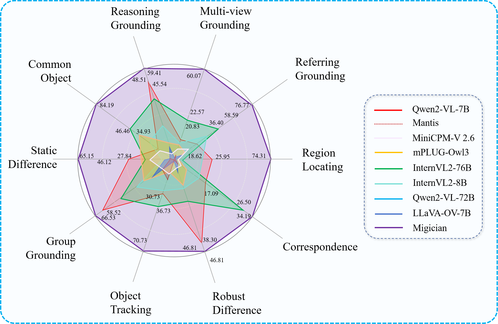

#  Migician: Revealing the Magic of Free-Form Multi-Image Grounding in Multimodal Large Language Models
[You Li](https://openreview.net/profile?id=~You_Li9), [Heyu Huang](https://openreview.net/profile?id=~Heyu_Huang2)*, [Chen Chi](https://openreview.net/profile?id=~Chi_Chen1), [Kaiyu Huang](https://openreview.net/profile?id=~Kaiyu_Huang1), Chao Huang, Zonghao Guo, Zhiyuan Liu, Jinan Xu, Yuhua Li, Ruixuan Li, Maosong Sun

-----

<a href='https://michael4933.github.io/'></a>
<a href='#'></a> 
<a href='https://arxiv.org/abs/2411.03628'></a> 
<a href='https://huggingface.co/datasets/Michael4933/MIG-Bench'></a> 
<a href='https://huggingface.co/datasets/Michael4933/MGrounding-630k'></a> 

This repository hosts the dataset/benchmark utilization, training implementation, and model weight of Migician, the first competitive Multi-image Grounding MLLM capable of free-form grounding.

-----------

## 📰 News
* **[2024.02.16]**  👀👀👀 Our [Paper](https://arxiv.org/abs/2411.03628) has been accepted by ACL2025 as a Oral Paper!
* **[2025.01.09]**  🔥🔥🔥 We have further released our multi-image grounding training dataset [MGrounding_630k](https://huggingface.co/datasets/Michael4933/MGrounding-630k) and our comprehensive multi-image grounding benchmark [MIG-Bench](https://huggingface.co/datasets/Michael4933/MIG-Bench) on Huggingface🤗~ Feel free to download and apply for your own use.
* **[2025.01.05]**  💪💪💪 The model weight is now available on HuggingFace! 🤗 [Huggingface Model](https://huggingface.co/Michael4933/Migician) Come and have a try!
* **[2025.01.02]** 💥💥💥 We have released our paper on [Arxiv](https://arxiv.org/abs/2411.03628) at the start of the new year!

## 📝 Abstract

The recent advancement of Multimodal Large Language Models (MLLMs) has significantly improved their fine-grained perception of single images and general comprehension across multiple images. However, existing MLLMs still face challenges in achieving precise grounding in complex multi-image scenarios. To address this, we first explore a Chain-of-Thought (CoT) framework that integrates single-image grounding with multi-image comprehension. While partially effective, it remains unstable and struggles to capture abstract visual information due to its non-end-to-end nature. Therefore, we introduce <strong>Migician</strong>, the first multi-image grounding model capable of performing free-form and accurate grounding across multiple images. To support this, we present the MGrounding-630k dataset, which comprises data for several multi-image grounding tasks derived from existing datasets, along with newly generated free-form grounding instruction-following data. Furthermore, we propose MIG-Bench, a comprehensive benchmark specifically designed for evaluating multi-image grounding capabilities. Experimental results demonstrate that our model achieves significantly superior multi-image grounding capabilities, outperforming the best existing MLLMs by 21.61% and even surpassing much larger 70B models.
          

## 😮 Top Multi-image Grounding Capacity
<p align="center">

</p>
<p align="center">

</p>
Migician not only exhibits superior performance than much larger 70B models in grounding task, but also demonstrates great competitiveness in general multi-image understanding tasks.

## 👉 Getting Started
<span id='all_catelogue'/>

### Table of Contents:

### 1. Environment  <a href='#all_catelogue'>[Back to Top]</a>
To establish the code environment, please follow the commands below.
Note, the training process is based on [Llama-fatory](https://github.com/hiyouga/LLaMA-Factory), where another set of environment configuration is more convenient for avoiding conflicts.
```
conda env create -n migician_train python=3.10
conda env create -n migician_eval python=3.10

git clone https://github.com/Migician/Migician.git
cd migician

conda activate migician_eval
pip install -r eval/requirements.txt # for evaluation and inference

conda activate migician_train
pip install -r train/requirements.txt # for model finetuning
```

### 2. Data Preparation <a href='#all_catelogue'>[Back to Top]</a>
We have uploaded our training dataset on [Huggingface](https://huggingface.co/datasets/Michael4933/MGrounding-630k) and organized it in a clear way.
You can download it at `./data/MGrounding-630k` and unzip the corresponding subsets. We provide all the textual conversation data at `./data/MGrounding-630k/MGrounding-630k.json` in the following format, where each training example is labeled with its corresponding sub-task class.
The download code of huggingface in provided in `./data/download.py`, which realizes one-hit quick download.
```
{
        "id": "5229016_8929009_6793119_3571391",
        "images": [
            "./MGrounding-630k/Group_Grounding/SA-1B/sa_5229016.jpg",
            "./MGrounding-630k/Group_Grounding/SA-1B/sa_8929009.jpg",
            "./MGrounding-630k/Group_Grounding/SA-1B/sa_6793119.jpg",
            "./MGrounding-630k/Group_Grounding/SA-1B/sa_3571391.jpg"
        ],
        "conversations": [
            {
                "from": "human",
                "value": "<image>\n<image>\n<image>\n<image>\nGive the bounding box of the region that this sentence refers to: <|object_ref_start|>a statue of a man<|object_ref_end|>."
            },
            {
                "from": "gpt",
                "value": "It's in the third image. <|box_start|>(316,58),(764,999)<|box_end|>"
            },
            {
                "from": "human",
                "value": "Recognize the target region that this sentence refers to: <|object_ref_start|>a woman wearing an orange shirt<|object_ref_end|>."
            },
            {
                "from": "gpt",
                "value": "It's in the first image. <|box_start|>(408,656),(578,997)<|box_end|>"
            }
        ],
        "type": "group_grounding"
    }
```
The final code structure is show as follows:
```
migician/
├──data/
│  ├──MGrounding-630k
│  │        ├── Common_Object
│  │        │            ├── COCO
│  │        │            ├── ImageNet
│  │        │            ├── Object365
│  │        │            ├── common_train_70k.json # the addtional .zip files at this level may be unhelpful
│  │        │
│  │        ├── Difference
│  │        │            ├── clevr-change
│  │        │            ├── img-diff
│  │        │            ├── magicbrush
│  │        │            ├── spot-the-diff
│  │        │            ├── diff_train_70k.json
│  │        │
│  │        ├── Free-Form
│  │        │            ├── Object365
│  │        │            ├── free_form_grounding_130k.json
│  │        │
│  │        ├── Group_Grounding
│  │        │            ├── SA-1B
│  │        │            ├── _gg_reg_40k.json # group grounding reg task
│  │        │            ├── gg_train_120k.json # group grounding rec task
│  │        │
│  │        ├── Object_Tracking
│  │        │            ├── GOT-10k
│  │        │            ├── LaSOT
│  │        │            ├── MOT17_image
│  │        │            ├── TrackingNet
│  │        │            ├── ot_train_130k.json
│  │        │
│  │        ├── Referring_Grounding
│  │        │            ├── ImageNet
│  │        │            ├── refer_train_70k.json
│  │        │
│  │        ├── Region_Locating
│  │                     ├── Object365
│  │                     ├── region_train_70k.json
│  │
│  ├── MGrounding-630k.json # containing all training examples
│
...
```

### 3. Inference and Evaluation <a href='#all_catelogue'>[Back to Top]</a>

#### Inference
Migician is finetuned on [Qwen2-vl-7B](https://huggingface.co/Qwen/Qwen2-VL-7B-Instruct) through a progressive two-stage training process. You can conduct multi-image grounding together with Migician through the [following code](https://github.com/QwenLM/Qwen2-VL).
<p align="center">

</p>
```
from transformers import Qwen2VLForConditionalGeneration, AutoTokenizer, AutoProcessor
from qwen_vl_utils import process_vision_info
import torch

model = Qwen2VLForConditionalGeneration.from_pretrained(
    "/home/liyou/opensource_models/qwen2-vl-7b",
    torch_dtype=torch.bfloat16,
    attn_implementation="flash_attention_2", # Enabling flash_attention_2 for better acceleration and memory saving, especially in multi-image and video scenarios is recommended.
    device_map="auto",
)

messages = [
    {
        "role": "user",
        "content": [
            {
                "type": "image",
                "image": resize("./figs/multi_view_1.png"),
            },
            {
                "type": "image",
                "image": resize("./figs/multi_view_2.png"),
            },
            {
                "type": "image",
                "image": resize("./figs/multi_view_3.png"),
            },
            {
                "type": "image",
                "image": resize("./figs/multi_view_4.png"),
            },
            {
                "type": "text",
                "text": "Please recognize <|object_ref_start|>the common person appearing in all these images<|object_ref_end|> and locate this person in all these image."
            }
        ]
    }
]

text = processor.apply_chat_template(messages, tokenize=False, add_generation_prompt=True)
image_inputs, video_inputs = process_vision_info(messages)
inputs = processor(text=[text],images=image_inputs,videos=video_inputs,padding=True,return_tensors="pt",)
inputs = inputs.to("cuda")

# Inference: Generation of the output
generated_ids = model.generate(**inputs, max_new_tokens=128)
generated_ids_trimmed = [
    out_ids[len(in_ids) :] for in_ids, out_ids in zip(inputs.input_ids, generated_ids)
]
output_text = processor.batch_decode(
    generated_ids_trimmed, skip_special_tokens=True, clean_up_tokenization_spaces=False
)
print(output_text)
```

#### Evaluation
The code structer for evaluation is as follows:
```
migician/
├──eval/
│  ├── MIG-Bench
│  │            ├── images
│  │            │       ├── common
│  │            │       ├── correspondence
│  │            │       ├── group_grounding
│  │            │       ...
│  │            ├── MIG_data.json # could be directly used for evaluation
│  │
│  ├── eval_output/
│  ├── others/ # MMIU and MIBench
│  │
│  ├── MIG_bench_cot.py # Executing MIG through single-image CoT framework
│  ├── MIG_bench_eval.py # Executing MIG by direct inference
│  ├── utils.py
│  ├── requirements.txt
│  ├── chat.py
```

Each testing example is formatted below, where the main informantion is task, images, question and answer.
Note: the answer is normalized as relative position within 0-1, following the x1_y1_x2_y2 format.
```
{
        "task": "reasoning",
        "images": [
            "./MIG-Bench/images/reasoning/case097_1.png",
            "./MIG-Bench/images/reasoning/case097_2.png"
        ],
        "question": "Which item in Image-2 share the similar feature of Image-1? Find it and locate it in the second image. ",
        "answer": [
            0.418,
            0.391,
            0.595,
            0.546
        ],
        "additional_info": "Which item in Image-2 share the similar feature of Image-1?",
        "need_format": true
    }
```
You can start one-hit evaluation for eight different models by running the MIG_bench_eval.py script, which reports IOU@0.7, IOU@0.5, IOU@0.3 and ave-iou scores. We further facilitate the evaluation for 🤗[MIBench](https://huggingface.co/datasets/StarBottle/MIBench) and 🤗[MMIU](https://huggingface.co/MMIUBenchmark/MMIU/tree/main) in MIG_bench_eval.py for different models.

#### Finetune
Our two-stage training process is conducted based on [Llamafactory](https://github.com/hiyouga/LLaMA-Factory), where the whole LLM backbone parameters are finetuned.
We provide our training script for these two stages and the requirements.txt file.
```
migician/
├── train/
│   ├── stage-1_finetune_full.yaml
│   ├── stage-2_finetune_full.yaml
│   ├── requirements.txt
```

## 📝 Citation
```bibtex
@article{lin2024streaming,
  title={StreamingBench: Assessing the Gap for MLLMs to Achieve Streaming Video Understanding},
  author={Junming Lin and Zheng Fang and Chi Chen and Zihao Wan and Fuwen Luo and Peng Li and Yang Liu and Maosong Sun},
  journal={arXiv preprint arXiv:2411.03628},
  year={2024}
}
```